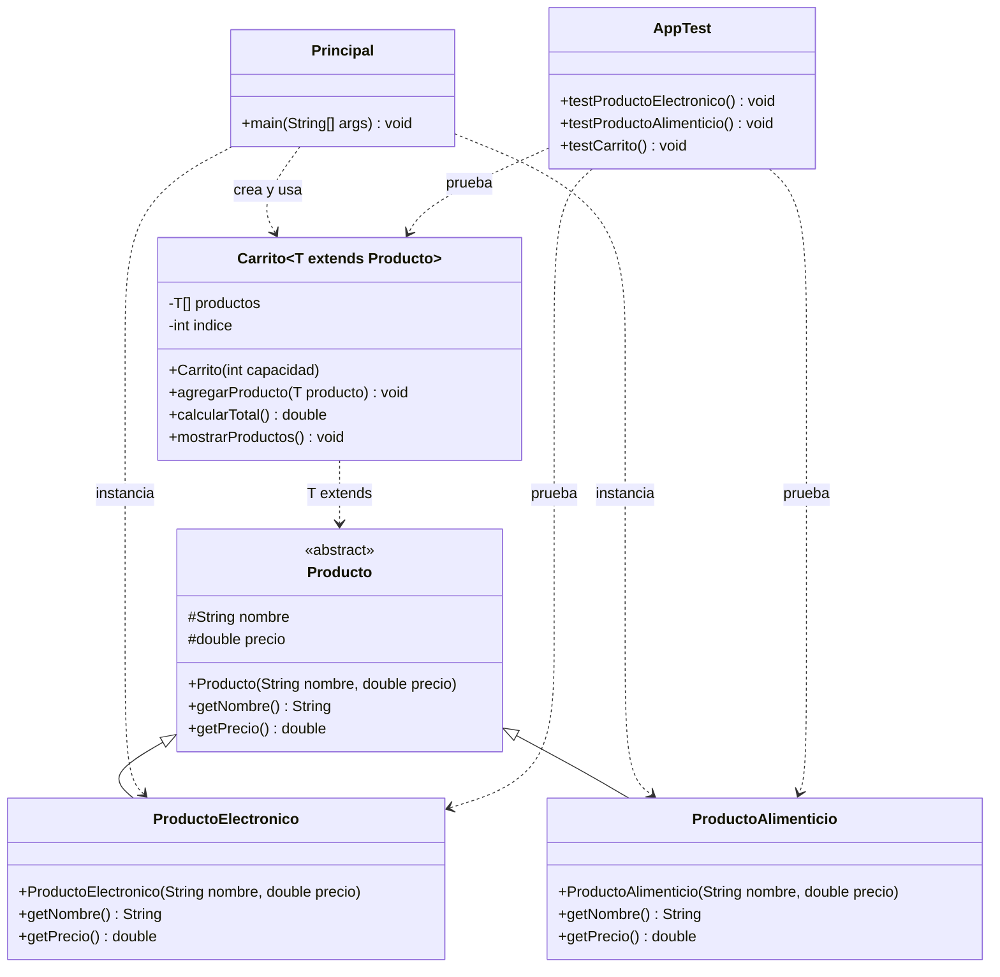

# Proyecto: Polimorfismo y Genéricos en Java

Este proyecto evalúa herencia, clases abstractas, polimorfismo, genéricos y pruebas unitarias en Java.

## 1. Objetivo

Construir un sistema básico de carrito de compras donde existan distintos tipos de producto y un carrito genérico capaz de almacenarlos, listarlos y calcular el total.

## 2. Estructura del proyecto

- clases/Producto.java
- clases/ProductoElectronico.java
- clases/ProductoAlimenticio.java
- clases/Carrito.java
- miPrincipal/Principal.java
- miTest/AppTest.java

## Diagrama de clases (UML)



## 3. Paso a paso de implementación

### Paso 1: Clase abstracta Producto
En clases/Producto.java:

1. Declarar la clase como abstracta.
2. Crear atributos protegidos:
1. nombre (String)
2. precio (double)
3. Crear constructor con nombre y precio.
4. Declarar métodos abstractos:
1. getNombre()
2. getPrecio()

### Paso 2: ProductoElectronico
En clases/ProductoElectronico.java:

1. Extender la clase Producto.
2. Crear constructor que llame a super(nombre, precio).
3. Implementar getNombre() y getPrecio().

### Paso 3: ProductoAlimenticio
En clases/ProductoAlimenticio.java:

1. Extender la clase Producto.
2. Crear constructor que llame a super(nombre, precio).
3. Implementar getNombre() y getPrecio().

### Paso 4: Carrito genérico
En clases/Carrito.java:

1. Declarar la clase como Carrito<T extends Producto>.
2. Crear arreglo interno de tipo T[] y un índice.
3. Constructor con capacidad para inicializar el arreglo.
4. Método agregarProducto(T producto):
1. Agrega el producto si hay espacio.
2. Si no hay espacio, muestra mensaje de carrito lleno.
5. Método calcularTotal():
1. Recorre los productos agregados.
2. Suma los precios.
3. Retorna el total.
6. Método mostrarProductos():
1. Recorre los productos agregados.
2. Muestra nombre y precio de cada producto.

### Paso 5: Programa principal
En miPrincipal/Principal.java:

1. Crear Carrito<Producto> con capacidad (ejemplo: 10).
2. Crear al menos un ProductoElectronico y un ProductoAlimenticio.
3. Agregar los productos al carrito.
4. Mostrar productos.
5. Mostrar total.

### Paso 6: Validación con pruebas
En miTest/AppTest.java:

1. Verificar que ProductoElectronico devuelve nombre y precio correctos.
2. Verificar que ProductoAlimenticio devuelve nombre y precio correctos.
3. Verificar que el carrito calcula correctamente el total.

## 4. Checklist de entrega

- Producto abstracto implementado.
- ProductoElectronico implementado.
- ProductoAlimenticio implementado.
- Carrito genérico implementado.
- calcularTotal() implementado.
- mostrarProductos() implementado.
- Flujo principal funcionando.
- Pruebas locales pasando.

## 5. Comandos con make

Compilar, probar y ejecutar:
```bash
make
```

Solo compilar:
```bash
make compile
```

Solo pruebas:
```bash
make test
```

Solo ejecutar app:
```bash
make run
```

Limpiar binarios:
```bash
make clean
```

## 6. Comandos manuales (Linux)

Compilar:
```bash
find ./ -type f -name "*.java" > compfiles.txt
javac -encoding utf-8 -d build -cp lib/junit-platform-console-standalone-1.5.2.jar @compfiles.txt
```

Ejecutar todas las pruebas:
```bash
java -jar lib/junit-platform-console-standalone-1.5.2.jar --class-path build --scan-class-path
```

Ejecutar una clase de pruebas:
```bash
java -jar lib/junit-platform-console-standalone-1.5.2.jar --class-path build --select-class miTest.AppTest
```

Ejecutar una prueba específica:
```bash
java -jar lib/junit-platform-console-standalone-1.5.2.jar --class-path build --select-method miTest.AppTest#testCarrito
```

Ejecutar aplicación:
```bash
java -cp build miPrincipal.Principal
```

## 7. Entrega a autograding

Guardar avances:
```bash
git add .
git commit -m "Descripción del cambio"
```

Subir a GitHub:
```bash
git push origin main
```
